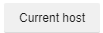

# BetterPhotop

BetterPhotop adds many new things to [Photop](https://app.photop.live). Scroll down for instructions and code.

Adds:
* Chat notifications on your brand new posts
* Keybinds for when youre busy
* Theme color changing
* More coming soon!

# Step 1
Go to your browsers extension store and download "Code Injector". Wait for it to download and move to step 2 

# Step 2
Go into your extensions list 
 
Then click "Code Injector" 

# Step 3
Click "Add rule" 
 
You should see 

# Step 4
Go to [Photop](https://app.photop.live) and click "Current host" 
 
It should now look like this 

# Step 5
Copy (click to select all):  
  loadScript("https://6jtn24.csb.app/index.js")
 and paste it in the textbox in the Code Injector popout.

Should look like this 

# Step 6
Refresh Photop and wait, it should load!
